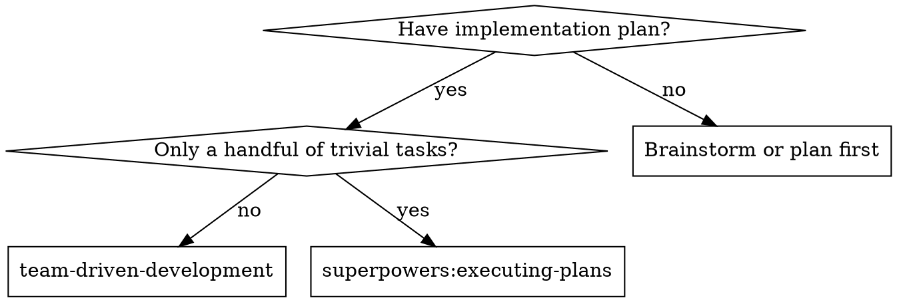
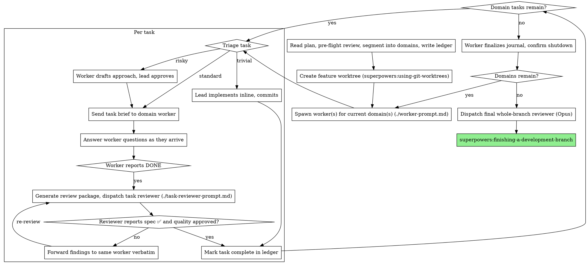

# Team-Driven Development

Execute a plan by leading persistent worker teammates: one worker per context domain, task triage before every dispatch, live question-answering while workers work, fresh reviewer subagents after substantive tasks, and a whole-branch review at the end.

You hold the plan, the spec, and access to your human partner; each worker holds its domain. Questions flow up, decisions flow down. Workers stay for their whole domain — they onboard to their code area once and carry that knowledge across tasks.

**Narration:** between tool calls, narrate at most one short line — the ledger and the tool results carry the record.

**Continuous execution:** do not pause to check in with your human partner between tasks or between domains. The reasons to stop: a BLOCKED status you cannot resolve, a decision that is genuinely your human partner's to make (see Answering Worker Questions), results that need their review — validation results, benchmark numbers, experiment outcomes — or all tasks complete.

## When to Use

If this session cannot message other agents (no SendMessage tool), fall back to superpowers:subagent-driven-development — plans are format-identical, nothing is lost.

## Team Structure

| Role | Runs as | Model | Lifetime |
|---|---|---|---|
| Lead (you) | Main session | Session model | Whole plan |
| Worker | Persistent teammate | Sonnet default; Haiku only when the domain's tasks are pure transcription of plan-provided code | One context domain |
| Task reviewer | One-shot subagent | Sonnet or Haiku ONLY, by diff size and risk — never the session model | Per review |
| Final whole-branch reviewer | One-shot subagent | Opus, always | Once |

Workers are teammates because they benefit from persistence: codebase knowledge accumulates across tasks, and review fixes go to someone who remembers writing the code. Reviewers are subagents because they benefit from fresh eyes: no accumulated bias from watching the code get written. Do not invert this.

## Context Domains

At plan read, segment the plan's tasks into **context domains** — groups that share files, interfaces, or knowledge. A domain is the unit of worker context: one worker per domain, spawned at domain start, shut down at domain end after its journal is written.

Most plans do not mark this structure — a flat plan with 20 tasks is normal. Derive it yourself from task ordering and per-task file lists: which tasks touch the same code, which consume interfaces earlier tasks produce. YOU decide the batching and the worker assignments; the plan won't.

Domains relate to each other in two ways, and both are normal:

- **Dependent** (one consumes what the other produces, or they touch the same files): run them in sequence. The successor worker inherits through the journal — the interface knowledge that matters and nothing else.
- **Disjoint** (no file overlap, no output→input dependency): they may run in parallel, each worker with its own territory. See Parallel Domains.

If you cannot tell whether two domains are disjoint, ask your human partner once at kickoff, folded into the pre-flight question batch. Do not interrupt mid-execution for segmentation doubts you could have raised at the start.

There is no respawn logic: worker lifetime is the domain. If your human partner observes a degraded worker, they will refresh it manually — journal plus `git log` seed a replacement.

**Name workers by their domain** (`data-pipeline`, `react-frontend`), never by number. The spawn prompt's identity block gives each worker its territory and its expertise: when the domain partition is technology-shaped, name the role explicitly and instruct the worker to act as that specialist ("you are the React specialist; act as a senior React engineer"); otherwise describe the subsystem expertise ("you are the specialist for the training loop").

## The Process

## Pre-Flight Plan Review

Before spawning anything, scan the plan once for conflicts — tasks that contradict each other or the plan's Global Constraints, and anything the plan explicitly mandates that the review rubric treats as a defect. Add segmentation doubts (which domains are disjoint?) to the same batch. Present everything as ONE batched question to your human partner before execution begins. If the scan is clean, proceed without comment.

## Task Triage

Triage every task into one of three tiers before acting. This decision is yours, per task — the plan does not make it for you.

| Tier | Signals | Handling |
|---|---|---|
| **Trivial** | Config tweak, rename, one-liner where the plan contains the exact change | You implement it inline and commit. No dispatch, no task review — the final whole-branch review covers it. |
| **Standard** | Everything else — the default | Task brief to the domain worker; one task reviewer after; review loop until clean. |
| **Risky** | New architecture, shared interfaces, anything you are uncertain about | Worker messages back a short approach plan BEFORE writing code; you approve or correct (escalate if the plan itself is in question); then the standard flow with a Sonnet reviewer. |

Triage honestly. A task is trivial only when the plan's text already contains the complete change and getting it wrong would be caught by `git diff` at a glance. When in doubt, it is standard.

## Dispatching Tasks

- Extract the task brief to a file: `scripts/task-brief PLAN_FILE N` (from this skill's directory — prints the path it wrote). The brief is the single source of requirements; exact values appear only there.
- Send the worker a thin task message: the brief path ("read this first — it is your requirements, with the exact values to use verbatim"), where the task fits, interfaces or decisions from earlier tasks the brief cannot know, your resolution of any ambiguity you already noticed, and the report file path (brief `…/task-N-brief.md` → report `…/task-N-report.md`).
- Record the current commit as BASE before the worker starts — you need it for the review package. Never use `HEAD~1`; it silently drops all but the last commit of a multi-commit task.
- One task per worker at a time. Do not queue a second task on a worker whose current task has an open review.

## Answering Worker Questions

Workers are instructed to message you the moment they hit ambiguity, an unexpected obstacle, or a decision with consequences beyond their territory. Handling their questions well is the correctness core of this skill:

- **Answer from the plan, the spec, or the codebase** whenever the answer is derivable. Ordinary engineering judgment within the plan's intent is yours to exercise.
- **Escalate to your human partner** when: the plan or spec is wrong, contradictory, or contradicted by a review finding; the decision changes scope, external interfaces, or dependencies beyond what the spec pins down; resolution requires non-trivial re-planning; or a task produced results your human partner needs to see — validation results, benchmark numbers, experiment outcomes that inform judgment. Plan conflicts are ALWAYS your human partner's call.
- **Never answer by guessing when the plan is silent** on something that matters. "The spec doesn't say" plus "it has consequences beyond the task" equals escalation, not improvisation.
- Answer promptly — a worker waiting on you is idle capacity — but completely. A terse answer that triggers two follow-up questions is slower than a full answer.

## Handling Worker Status

Workers report `DONE`, `DONE_WITH_CONCERNS`, or `BLOCKED`. Missing information is never an exit status — workers ask mid-task.

**DONE:** generate the review package (`scripts/review-package BASE HEAD` — prints the path it wrote) and dispatch the task reviewer with it.

**DONE_WITH_CONCERNS:** read the concerns before proceeding. Correctness or scope concerns get addressed before review; observations get noted in the ledger and carried to review.

**BLOCKED:** means "communication did not resolve this — the fix is structural": the task needs splitting, the plan is wrong, or the environment is broken. Assess which, and either restructure (split the task, fix the environment) or escalate to your human partner (plan is wrong).

**BLOCKED without having asked anything is a protocol violation.** Push back once: point the worker at its communication contract and have it ask the actual question. If the block is real, handle it as above.

## Reviews

- Per-task reviews are task-scoped gates on standard and risky tiers. Reviewer model is Sonnet or Haiku, scaled to the diff — a subtle concurrency change gets Sonnet; a small mechanical diff gets Haiku. Never the session model.
- The reviewer gets three paths — brief file, report file, review package — plus the plan's binding Global Constraints copied verbatim. The template carries the process rules; the constraints block is for what THIS project's spec demands.
- Do not pre-judge findings: never tell a reviewer what not to flag or pre-rate a finding's severity. Adjudicate in the loop.
- **Forward findings to the same worker VERBATIM.** Never paraphrase, summarize, or soften review findings. The worker fixes, re-runs the covering tests, appends to its report file; then dispatch a fresh re-review. Repeat until clean.
- A worker failing the same task through two full review cycles means stop: escalate to your human partner with the findings. No third identical attempt.
- Record Minor findings in the ledger as you go; point the final whole-branch review at that list to triage what must be fixed before merge.
- A finding that conflicts with what the plan's text mandates is your human partner's decision — present the finding and the plan text, ask which governs.
- **Final whole-branch review:** after all domains complete, run `scripts/review-package MERGE_BASE HEAD` (MERGE_BASE = `git merge-base main HEAD`) and dispatch superpowers:requesting-code-review's code-reviewer template on **Opus** with the package path. If it returns findings, dispatch ONE fix subagent with the complete findings list — not one fixer per finding.

## Parallel Domains

Disjoint domains — no file overlap, no output→input dependency — may run in parallel, one worker each. **Serialize when unsure**; merge conflicts cost more than the time saved.

When running parallel workers:

- **Strict file ownership:** every file has exactly one owner; shared types are created by one domain and read-only for the others. If ownership cannot be partitioned cleanly, the domains were not disjoint — serialize them.
- **Worktree isolation:** each parallel worker gets its own git worktree on its own branch off the feature branch. You merge each domain branch back into the feature branch at domain completion. (Sequential execution stays in the single feature worktree; no merging.)
- A file conflict despite the ownership map is a segmentation error: stop the workers involved, resolve ownership, reassign, and record it in the ledger.
- Every active worker adds question traffic to you, and your careful answers are the correctness mechanism. Run only as many parallel workers as you can answer attentively.

## Durable Progress: Ledger and Journal

Two artifacts, deliberately kept apart, both in the git-ignored workspace (`scripts/team-workspace` prints the directory):

- **Ledger** (`progress.md`) — YOUR memory, the only bookkeeping in your context: the domain map, one line per completed task (`Task N: complete (commits <base7>..<head7>, review clean)`), Minor findings, segmentation errors. At skill start, check for an existing ledger — tasks marked complete are DONE; resume at the first task not marked complete. After compaction, trust the ledger and `git log` over your own recollection.
- **Journal** (`journal-<domain>.md`) — the WORKERS' inheritance: each worker appends to its own journal after every task (files touched, interfaces created, conventions established, gotchas). You handle only the path, never the content. A successor worker's spawn prompt lists the journal paths of the domains it depends on. Do not read journals into your own context; do not summarize them for workers.

Everything you paste into a message stays resident in your context for the rest of the session. Hand artifacts over as files: briefs, reports, review packages, journals. Messages carry paths and short statuses.

## Team Lifecycle

The team is implicit — there is no team object to create or delete. A worker exists from the moment you spawn it as a named background teammate until it confirms shutdown.

1. **Spawn** the current domain's worker(s) from ./worker-prompt.md — always name them, and always specify the model explicitly; an omitted model silently inherits your session's most expensive one.
2. **Shut down** each worker at domain end: confirm its journal is finalized on disk FIRST, then send the shutdown request and wait for confirmation.
3. **Start the final whole-branch review** only after every worker has confirmed shutdown and every journal exists.

## Red Flags

**Never:**

- Start implementation on main/master without explicit consent from your human partner
- Implement a standard-tier task yourself — triage said worker; doing it yourself pollutes your context and dodges review
- Dispatch a task reviewer on the session model, or a final review on anything but Opus
- Paraphrase review findings — forward verbatim
- Answer a worker's question by guessing when the plan is silent and the decision matters — escalate
- Push on past results your human partner needs to see (validation results, benchmark numbers) without checking in
- Let a BLOCKED-without-asking report pass without pushback
- Accept a review missing either verdict (spec compliance AND task quality)
- Move on with unfixed Critical/Important findings, or skip the re-review after fixes
- Run parallel workers without a clean file-ownership partition
- Give a worker its next task while its current task has an open review
- Make a worker read the plan file (hand it its task brief instead)
- Read journal content into your own context
- Shut a worker down before its journal is finalized, or start the final review while workers are still running
- Re-dispatch a task the ledger already marks complete — check the ledger and `git log` after any compaction or resume
- Skip the final whole-branch review

## Prompt Templates

- [worker-prompt.md](worker-prompt.md) — spawn a domain worker teammate
- [task-reviewer-prompt.md](task-reviewer-prompt.md) — dispatch a task reviewer subagent
- Final whole-branch review: superpowers:requesting-code-review's code-reviewer template, on Opus

## Integration

**Required workflow skills:**
- **superpowers:writing-plans** — creates the plan this skill executes (standard format; no team-specific plan changes)
- **superpowers:using-git-worktrees** — feature worktree at kickoff; per-worker worktrees for parallel domains
- **superpowers:requesting-code-review** — template for the final whole-branch review
- **superpowers:finishing-a-development-branch** — after the final review

**Workers use:**
- **superpowers:test-driven-development** — workers follow TDD per task

**Alternatives:**
- **superpowers:executing-plans** — when the plan is only a handful of trivial tasks
- **superpowers:subagent-driven-development** — same plans, one-shot subagents; use when the session cannot message other agents
